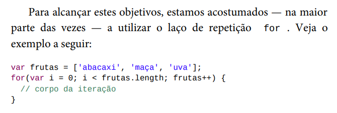
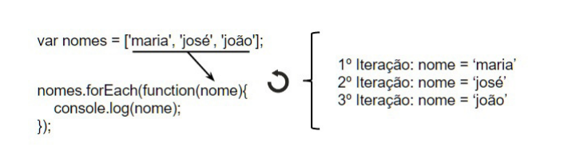
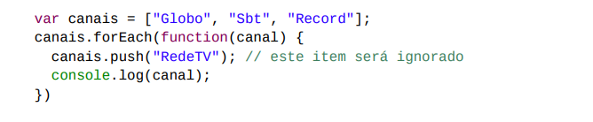
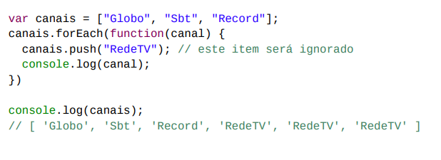

<h1 align="center"> EcmaScript 6 - Array / Metodos </h1>

<h2>iteracao classica</h2>

<h2> forEach </h2>

forEach e o metodo onde ele passa por todo array
e retornando 

              let names = ["john","Doe","maria"]
              names.forEach(function(name){
                console.log(name)
              })

              // john,Doe,maria
    

        
 
<li  style="font-size:18px">
  neste exemplo mostramos como ele funciona :
</li>

 

No forEach os elementos são determinados antes da 
  primeira função de cb  
caso seja adiciona depois da cb não serão visto exemplo

 

Veja	 com	 atenção	 o	 que	 foi	 feito.	 Atribuímos	 a	 uma	 variável
  chamada	 	canais		 uma	 lista	 que	 representa	 canais	 da	 televisão
  aberta	 brasileira.	 A	 seguir,	 invocamos	 o	 	forEach		 e,	 dentro	 do
    callback	,	inserimos	o	canal		RedeTV		na	nossa	lista.	Ao	executar	o
  código,	podemos	ver	que	a		RedeTV		nunca	é	exibida,porque elementos são 
  determinado antes da primeira invocação
  

  

  <h2 align="center"> Metodo Map </h2>

  

  O método map e util quando não somente queremofa-spin
  passar por todo elementos,mas tambem podemos modifica-lo

    caso precisamos de algoritmo que duplica valor:

<li >Modo tradicional :</li>

      let numero = [2,4,6,8,10];
      let dobro = [];
       
      // utilizaremos:

      for(let i = 0;i < numbero.length;i++){
        dobro.push(numero.length[i] * 2 )
      }
       // criaremos novo array onde vai receber 
            numero em dobro [4,8,12,16,20]

<li>utlizando o metodo map </li>

          let number = [1,2,3];
          let double = number.map((num) => return num * 2)

          console.log(double) // saida 2,4,6

 
    o map executa a função cb recebida por parametro
    para cada elemento iterado de num ele constroi um novo Array

<h2 align="center"> Metodo Filter</h2>

    como o proprio nome ja pode induzir,este metodo e deve 
    utilizando quando temos a necessidade de filtrar nossa lista 
    de acordo com algum criterio

<li style="font-size:18px">  for class 

          const alunos = [
          {nome:"aluno_1", idade:15},
          {nome:"aluno_2",idade:12},
          {nome:"aluno_3",idade:20}
          ];

          let alunoMaiorIdade = [];
            // for tradicional :
          for(let i = 0;i < alunos.length;i++){
            if(alunos[i].idade >= 18){
              alunoMaiorIdade.push(alunos.[i]);
            }
          }

<li  style="font-size:18px"> Utilizando o filter :

          const alunos = [
          {nome:"aluno_1", idade:15},
         {nome:"aluno_2",idade:12},
         {nome:"aluno_3",idade:20}
          ];

          let maiorIdade = alunos.filter((aluno){
            return aluno.idade > 18
          })

 no filter a função de cb recebe como parametro um 
  dos alunos da lista em cada iteração 
assim como nas outras função auxiliares que vimos 
e o atirbui variavel aluno onde devolve valor booleano 
          