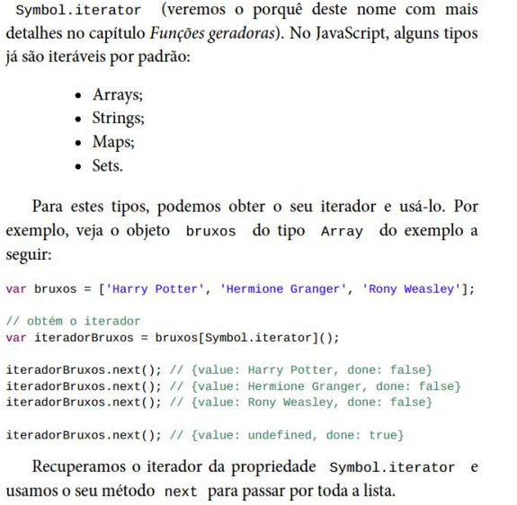
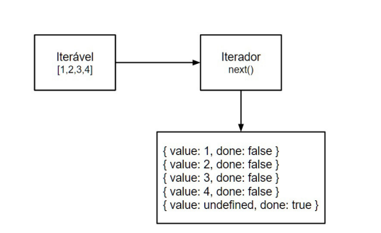
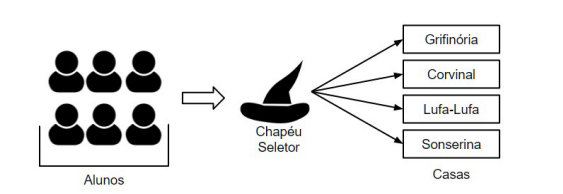

<h1 align="center"> Arrays </h1>

<h2 style="center"> Iteradores </h2>

  um	a	um,	os	itens	de	um	iterável,	enquanto	mantém	o	status	da	sua
posição	atual	na	estrutura.	Esses	objetos	oferecem	o	método		next	,
que	 retorna	 o	 próximo	 item	 da	 estrutura	 do	 iterável	 sempre	 que
invocado.
Na	 realidade,	 este	 método	 retorna	 um	 outro	 objeto	 com	 duas
propriedades:		done		e		value	.	O		done		é	um	valor	booleano	que
indica	se	toda	a	estrutura	foi	acessada,	enquanto	o		value		contém	o
valor	extraído.

  Por	 exemplo,	 se	 tivermos	 uma	 coleção	 com	 um	 único	 número
  (o	número	1)	 e	 chamarmos	 o	método		next		 uma	 vez,	 obteremos
  este	valor:

            iteravel.next();	//	{value:	1,	done:	false}
            
  Se	chamamos	novamente	o		next	,	não	temos	mais	valor,	pois	a
  coleção	 inteira	 já	foi	 percorrida.	 Entretanto,	 temos	 a	 indicação	 de
  que	ela	foi	finalizada	na	propriedade		done		que	retornará		true	:
  
  
            iteravel.next();	//	{value:	undefined,	done:	true}
  

<h2> Itaraveis </h2>

 
    

      Um	objeto	é	definido	como	iterável	se	ele	define	explicitamente
      o	 seu	 comportamento	 de	 iteração.	 Para	 isso,	 é	 necessário	 que	 ele
      implemente	 o	 seu	 iterador	 na	 propriedade	 de	 chave

    

    

<h2> iteraveis e iterador na pratica </h2>

 

  

      Na	prática,	a	utilização	desta	estrutura	de	iteradores	e	iteráveis	é
      sempre	 feita	 pelo	 laço	 de	 repetição	 	for...of		 e	 geradores.	 Mas
      nada	impede	que	usemos	a	estrutura	sem	eles.
      Por	exemplo,	vamos	 supor	que	queremos	fazer	uma	 simulação
      do	Chapéu	Seletor	de	Hogwarts,	escola	de	bruxos	da	série	de	livros
      do	Harry	Potter,	da	J.K.	Rowling.	Para	cada	bruxo,	o	Chapéu	Seletor
      deve	fazer	a	seleção	de	sua	casa	de	acordo	com	os	seus	critérios	(que
      não	sabemos).	Este	processo	deve	ser	repetido	para	todos	os	bruxos,
      mesmo	não	sabendo	de	antemão	quantos	serão	(sempre	haverá	pelo
      menos	um,	se	não	a	escola	vai	ficar	às	moscas).
    

    
  

  

   

      Para	 fazer	 isso,	 vamos	 utilizar	 iteradores	 e	 iteráveis.
      Assumiremos	que	 todos	os	bruxos	estão	em	um		Array		 chamado
	    bruxos		e	que	recebemos	essa	coleção	para	iterá-la.	Podemos	obter
      o	iterador	da	coleção	de	bruxos	e	usar	a	propriedade		done		em	um
      laço	de	repetição		do...while	:
    

        let	iterador	=	bruxos[Symbol.iterator]();
        let	done	=	false;
        let	proximo	=	iterador.next();
           do	{
                var	bruxo	=	proximo.value;
                chapeuSeletor.fazerSelecaoDaCasa(bruxo);
                proximo	=	iterador.next();
              }	while	(!proximo.done);

              aluno:	Harry	Potter	|	casa:	Grifinória
              aluno:	Hermione	Granger	|	casa:	Grifinória
              aluno:	Rony	Weasley	|	casa:	Grifinória
    

