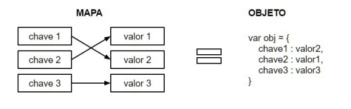

<h1 align="center"> Array - WeakMap Map</h1>

  Mapas	 são	estruturas	de	dados	em	que	é	possível	associar	uma
chave	 a	 um	 valor	 —	 como	 em	 um	 dicionário,	 onde	 há	 um
significado	correspondente	para	cada	palavra.	Cada	uma	das	chaves
é	 única	 e	 possui	 apenas	 um	 valor	 associado,	 mesmo	 que	 este	 se
repita	em	várias	chaves.
Quando	 estamos	 falando	 de	 JavaScript,	 podemos	 considerar
todo	objeto	um	mapa.	Afinal,	ambos	são	constituídos	por	pares	de
chave/valor,	 sendo	 a	 chave	 o	 nome	 dos	 atributos	 e	 os	 valores	 as
funções,	objetos	e/ou	expressões

  Com	 a	 chegada	 do	 ES6,	 o	 JavaScript	 introduz	 duas	 novas
  estruturas	 de	 dados:	 	 Map	 	 e	 	 WeakMap	 .	 Essas	 estruturas,	 ao
  contrário	da	tradicional	concepção	de	que	todos	objetos	são	mapas,são 
  implementações reais de mapas como estrutura de dados,assim como já estamos 
  acostumado a ver em outra linguagem.estas novas estrutura nos permitem:

  <li style="font-size:17.8px;">Adicionar elementos pelo par (chave,valor)
  <li style="font-size:17.8px;">Remover elementos pela chave 
  <li style="font-size:17.8px;">acessar elemento dada um chave 
  <li style="font-size:17.8px;">Pesquisar elementos, descobrindo se ele pertece ou não a 
    coleção por meio da chave

  <li style="font-size:18px;">indagar sobre atributos como o numero de elementos 

<h2 align="center"> Map </h2>

  Em um Map do Js,qualquer valor (tanto objetos,funções ou valorees primitivos)
  pçodem ser usados como chave ou valor,note como conseguimos definir todos este 
  tipos de valores nos nosso mapa como o metodo set:

  exemplo:

        let map = new Map()
        function f(){}
        let obj = {}

        map.set('string','sou uma string')
        map.set(objeto, 'sou um objeto')
        map.set(funcao, 'sou uma função')
        
        para recupera os valores do mapa atraves das chaves,empregamos o metodo get.

        map.get("srting")
        map.get(objeto)
        map.get(funcao)

alem desse metodos , o Map traz algumas outras funçoes e
propriedade interessantes em sua implementação,para saber 
quanto items um mapa,usamos a propriedade size: 

          console.log("tamanho" + map.size)

para saber se ja existe uma chave especifica dentro do mapa utilizamos o metodo has 
ele retorna um valor:
booleano: true 
caso exista: false 

 <li style="font-size:18px;">  tambem podemos remover um registro especifico do mapa com o metodo delete 
  passando como parametro a chave do registro que queremos eliminar, Neste exemplo 
   removemos a chave string e usamos o has para validar que ele não existe mais 
   map.delete("string")
   console.log(map.has("string"))

<li style="font-size:18px;"> 
  há tambem a possibilidade  de eliminar todos os registro do 
  mapa usando o metodo clear,quando  o usamos todo pares de 
  chave/valor são removidos e o mapa fica vazio: 

      map.clear()
      console.log("tamanho" + map.size) 

  e por fim como vimos nos capitulos anteriores, o map e um objeto iteravel,
  sendo assim,podemos utilizar laço for of  para itera-los atraves do metodo 
  atraves dos metodo: keys,value e entries .eles retornam toda as key, 
  todos os valores e toda as entradas (par key/valor) 

  let	mapa	=	new	Map();
  mapa.set('um',	1);
  mapa.set('dois',	2);
  mapa.set('três',	3);
  for(let	chave	of	mapa.keys()){
      console.log(chave);	//	um	dois	três
  }
  for(let	valor	of	mapa.values()){
    console.log(valor) // 1 2 3
  }
  for(let entrada of mapa.entries()){
    console.log(entrada)
  }
 

<h1 align="center"> Map vs Objetos </h1>

<h3> quando utilizar ?</h3>

  Objetos no js sempre fora usdo como map,afinal 
  ambos são similares no que diz a respeito a deixar 
  adicionar key/value, recuperar estes valores atravez das respectivas
  keys e apaga-los tambem por meio delas,por convencao,as intancia de Map 
  são teis somente para coleções e objetos em geral devem 
  ser usados como registro,como campos e metodos

  mas nem sempre essa regra e válida,para nos ajudar em como 
  decidir quando usar numa estrutura:

  <li style="font-size:18px;">AS chaves são conhecidas ate o tempo de execução 
    ou você precisa procura-las dinamicamente?
  <li style="font-size:18px;">todo os valores sempre serão o mesmo tipo,e podem 
    ser usados de forma intercambiavel
  <li style="font-size:18px;"> voce precisa de chave que não são strings?
  <li style="font-size:18px;">Os pares chave/valor são adicionados ou removiveis 
  <li style="font-size:18px;"> você tem uma quantidade de pares key/value arbitraria 
  <li style="font-size:18px;">a coleção e iterada?

se resposta for sim ,necessita de instancia de Map.

<h3> WeakMap </h3>

  Um		WeakMap		é	uma	coleção	de	pares	de	chave/valor	na	qual	as
  chaves	 só	 podem	 ser	 objetos.	As	 referências	 do	 objetos	 nas	 chaves
  são	 fracamente	 mantidas.	 Isso	 significa	 que	 eles	 não	 estão
  previnidos	 de	 serem	 coletados	 pelo	 Garbage	 Collector	 caso	 não
  existir	nenhuma	outra	referência	para	o	objeto	em	memória.

          let	weakMap	=	new	WeakMap();
          let	elemento1	=	window;
          let	elemento2	=	document.querySelector('body');
          weakMap.set(elemento1,	'sou	o	elemento1');
          weakMap.set(elemento2,	'sou	o	elemento2');

  <h3> onde usar WeakMap </h3>

  

    Para	 a	 maior	 parte	 dos	 problemas,	 a
    implementação	 de	 	Map		 será	 o	 suficiente.	 Quando	 usamos	 um
      WeakMap	,	 temos	 a	 vantagem	 de	 que	 ele	 nos	 permite	 armazenar
      dados em um objeto particular na nossa aplicação e,quando este 
      objeto e destruido,os dados tambem são destruidos e a 
      memoria fica livre para atuar em novos processo,isso e bacana pois nos da 
      segurança de que não havera probleam de vazamento de memoria na aplicação:
  

